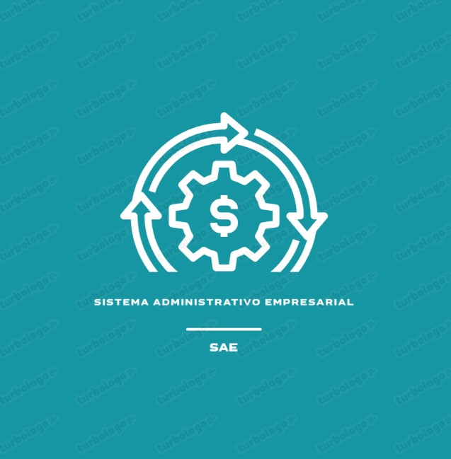
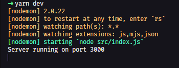

<!-- Banner SAE -->
<div align="center">
	
  
</div>
<br>
<div align="center">
	<a href="https://git.io/typing-svg"></a>
</div>
<br>
<div align="center">
<p align="center">  </p>


<p>
  ·
  <a href="/docs/readme_es.md">Español</a>
  ·
</p>

<h3 align="left">Connect with me:</h3>
<p align="left">
</p>

  
  
</div>

<!-- Información principal -->
# SAE

SAGA es un sistema diseñado para mejorar la administracion de pequeñas y grandes empresas

<!-- Stack utilizado -->
## Tech Stack

**Client:** <br>
<a href="https://react.dev/" target="_blank" rel="noreferrer"> </a>
<a href="https://es.redux.js.org/" target="_blank" rel="noreferrer"> </a>
<a href="https://getbootstrap.com" target="_blank" rel="noreferrer"> </a>

**Server:** <br>
<a href="https://nodejs.org/es" target="_blank" rel="noreferrer"> </a>
<a href="https://expressjs.com/" target="_blank" rel="noreferrer"> </a>
<a href="https://www.mysql.com/" target="_blank" rel="noreferrer"> </a>
<a href="https://www.mongodb.com/es" target="_blank" rel="noreferrer"> </a>

## Deployment


<p>
  En este proyecto es posibles utilizan yarn como npm.
</p>

### 🐱‍💻Back-end
<p>
  Para ejecutar el servidor primero entramos al directorio raíz del <a href="./backend/">backend</a> 
</p>

<p>
  Estando acá instalamos las dependencias de yarn/npm
</p>

```bash
  yarn install
```
<br>

**Development**
<p>
  Si se utiliza en desarrollo utilizaremos:
</p>

```bash
  yarn dev
```

<div align="center">
	
</div>

<br>

**Production**
<p>
  Y para producción utilizaremos:
</p>

```bash
  yarn star
```
---
### 💻Front-end
<p>
  Para ejecutar la vista entraremos al directorio raíz del <a href="Public/img/backend_dev.png">frontend</a> 
</p>

<p>
  Estando acá instalamos las dependencias de yarn/npm acá utilizamos <a href="https://vitejs.dev/">vite</a>
</p>

```bash
  npm install
```
<br>

**Development**
<p>
  Si se utiliza en desarrollo utilizaremos:
</p>

```bash
  npm run dev
```


<br>

**Production**
<p>
  Y para producción utilizaremos:
</p>

```bash
  npm run deploy
```


<!-- Autores del proyecto -->
## 👨‍💻Authors

- [@Juancastro27](https://github.com/juancastro27)
- [@EdwardM28](https://github.com/EdwardM28)
- [@katheszv](https://github.com/katheszv)

## 👨‍🏫Leaders Instructors
- [@hdtoledo](https://github.com/hdtoledo)

<!-- Documentación oficial -->
## Documentación Oficial

[Documentación v1.9](https://docs.google.com/document/d/1Savy7Rl1RXcVc7oTE73I-Ue3_nd-7G1Z/edit?usp=sharing&ouid=102635390576364738500&rtpof=true&sd=true)

Hecho con :heart: y JavaScript.
